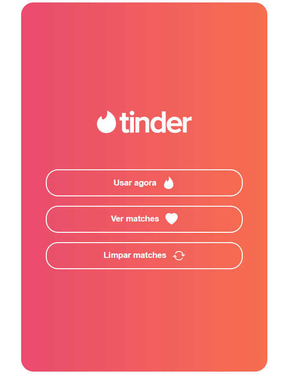
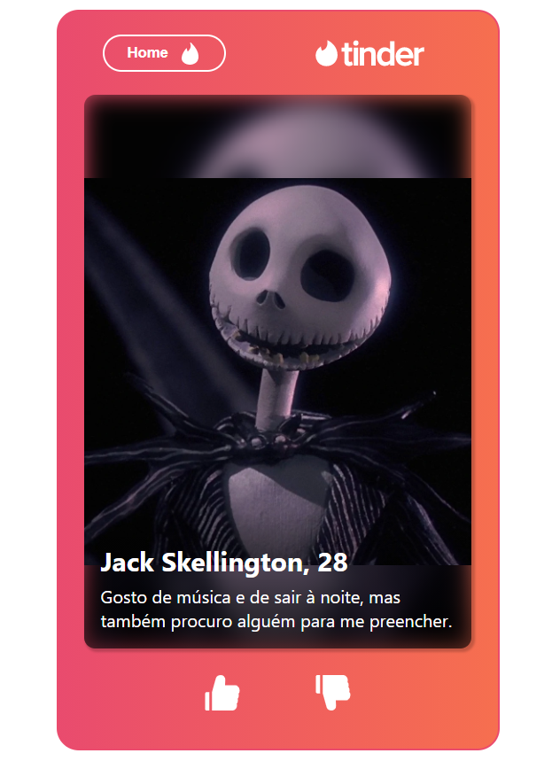
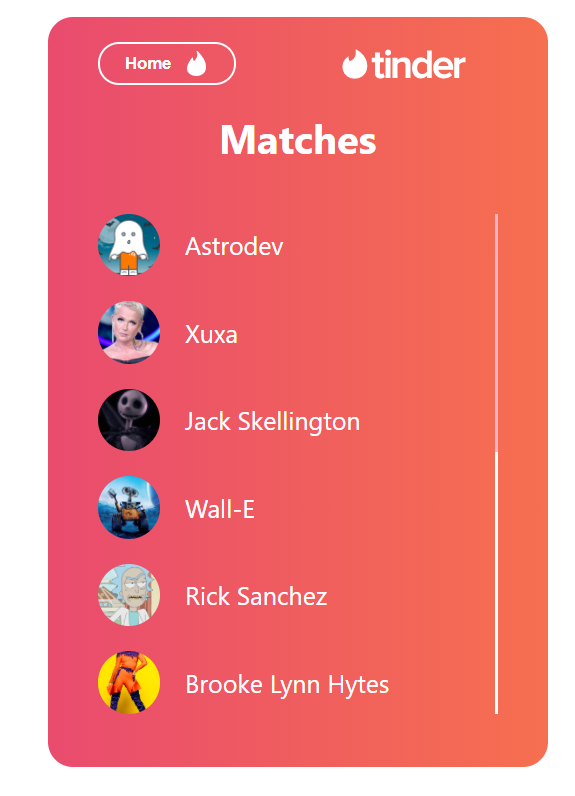
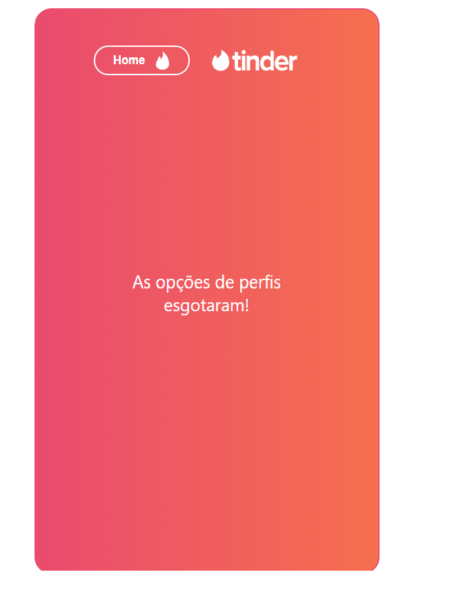

# Astromatch

O projeto Astromatch tem como inspiração o App de relacionamentos Tinder. No Astromatch é possível dar match nos mais variados astros e, - caso você tenha sorte -, pode receber um match de volta!

## Link de acesso

https://astromatch-ingrid.surge.sh/

## Desenvolvedora

Ingrid Erci Flack da Silva

## Tecnologias Utilizadas

- ReactJs
- Styled Components
- Axios

## Funcionalidades

- O usuário pode ver cards de perfis com sua determinada descrição (foto, nome, idade e bio);

- O usuário pode dar "like" e "dislike" nos perfis, conforme seu gosto;

- Ao dar like, o usuário poderá ser correspondido, recebendo uma mensagem que informa que ocorreu um "match";

- O usuário tem a opção de visualizar todos os matches correspondidos ao clicar no botão "Ver matches";

- O usuário pode resetar os matches clicando no botão "Limpar matches";

- Em todas as páginas existe a opção de voltar para a tela inicial;

- O projeto é responsivo para desktops, tablets e smartphones.

## Status do projeto

Concluído ✅

## Telas

- Tela Inicial

- Tela com perfis

- Tela com matches

- Tela quando esgotaram as opções de perfis

